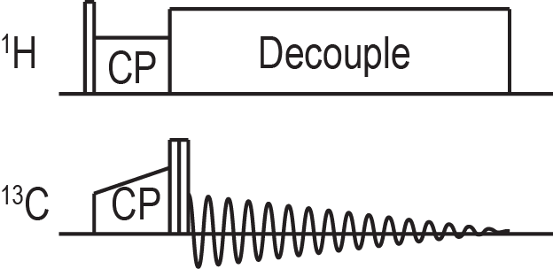

# Running Routine Experiments
## Introduction
While it is entirely possible to write your own pulse sequences in RNMR, many have already been written for common
experiments. These existing experiments will generally include a pulse program file (some_experiment.pp) and a macro to
set up the experiment (some_experiment.rnmrm). Both macros and pulse programs are explained in more depth in other
sections of this documentation, but a few basics will be explained here. The first time you use a pulse program you may
need to compile it using the following command from the terminal in your pp folder (not within RNMR):

    pprog some_experiment.pp

## A Brief Primer On Macros
Macros are text files containing RNMR commands. When a macro is called the commands are executed sequentially just as if
they had been entered at the command line in RNMR. Macros also have some facilities for control flow, can accept
arguments, and can make use of both global and local variables. A few macros were introduced in the section on running
one pulse experiments, RUN and PROC.

The first time you use a particular macro, or any time you alter a macro using a text editor outside of RNMR you must
tell RNMR to load it from the file (some_macro.rnmrm) by typing `MACRO SOME_MACRO`. Subsequently you can run the macro
by simply typing SOME_MACRO. Macros can also be edited from within RNMR using `EDTMAC`.

Global variables can be set using `DFNGBL` and are used by prepending the argument name with `%`. % followed by a name
will be replaced by the value of the global argument. Local variables use `DFNLCL` and `&` for these same purposes. Note
that RNMR is not case sensitive so do not for example attempt to name different variables A and a. Everything on a line
in a macro that comes after a ; is a comment and will not do anythin.

## Invoking an Experiment
A common workflow in RNMR makes use of the utility macro mr.rnmrm. Create a text file which typically should have the
same name as the archive in which data will be saved (some_name.rnmrm). Then set the global argument r to be that name
by typing `DFNGBL R SOME_NAME`. An example of what the macro might look like follows:
```no-highlight
goto .r&1                       ;Jump to a label. In this case if local arg 1
                                ;has the value 5 it will jump to the label .r5
.r5                             ;A label that can be jumped to
macro justcp                    ;Load the justcp macro from its file
justcp setup                    ;Call the setup submacro within justcp
;justcp ccal                    ;Uncomment to calibrate 13C powers
titlea 'adamantane'             ;Set the title to reflect the sample
unit /freq ppm                  ;Set the frequency to be in units of ppm
f 1 35                          ;Set the 13C channel transmitter to 35 ppm
f 2 1                           ;Set the 1H channel transmitter to 1 ppm
;C13 CP condition                Just a comment
setramp cpdly 1 80 10           ;Call a macro to set the power of the ramped cp
                                ;to have a center of pwx 80 and a ramp of 10 pwx
pwx 2 cpdly2 36                 ;Set the 1H cp power
d cpdly 10                      ;Set the length of the cp to 10 ms
pwx 2 cppls2 83                 ;Set the power of the initial 1H flip pulse
p cppls 3                       ;Set the length of the 1H flip pulse to 3 us
super 2,sample,on,*,29.7,17.0   ;Set the tppm decoupling power and pulse length
supsxval 2,sample,tppm,11,0     ;Set the tppm decoupling phases
suacq 20,1024,3,30,4,0,10       ;Set up acquisition parameters
;dwell,size,rd,gain,na,ndly,p8   Just a comment
pwx 1 flip 89                   ;Set the power for the 13C channel flip pulses
p flipup 0                      ;Set the length of the first flip pulse to 0
p flipdn 0                      ;Set the length of the second flip pulse to 0
run                             ;Run the experiment
mexit                           ;Exit the macro
```
The command `MR 5` will now run everything between .r5 and mexit. It will be instructive to step through this macro line
by line to understand what it does. As such comments have been added to each line here, but they would not normally be
included most of the time. This particular example will run the justcp experiment pictured here:



This method of invoking experiments is quite convenient for organization. Additional submacros can be added to run
different experiments or samples. It is useful to have the labels in the submacros correspond to the records in which
you store the corresponding data. The macro also keeps a nice record of what you have done for future reference.

Many of the commands used in this macro must specify which channel they are operating on. The channel numbers here refer
to the logical channels, which are distinct from the numbers of the hardware channels on the spectrometer. The channel
on which you detect is always logical channel 1, which is why in this case 1 is the 13C channel and 2 is the 1H channel.

You will also notice that the length of most of the pulses are set with the `P` command but the length of the cp is set
using `D`. This distinction is based upon how they are defined within the pulse program. The `P` command is in
microseconds and is generally used for short pulses, while `D` is in milliseconds and is generally used for longer
periods such as the cp contact time or the mixing time in certain recoupling experiments.

## Calibrating Pulse Powers
It is important to be able to determine the appropriate power level to use to produce a particular nutation frequency.
The justcp experiment invoked above can be used for this purpose. This experiment should give a maximum signal when the
initial ¹H flip pulse (cppls) is 90° and should give no signal at all when it is 180°.

The typical procedure once you have observed that your justcp experiment does in fact give you some signal is to set the
length of the flip pulse to correspond to a 180° pulse at a particular frequency. For example, to calibrate an 83 KHz
pulse for the ¹H channel set the pulse to 6 us. Then adjust the power of the pulse until there is no signal.
Cutting the length of the pulse in half should then give a maximum signal as it would be a 90° pulse.

In order to calibrate 13C powers we use the flipup and flipdn pulses which both have the same power. Uncomment the call
to justcp ccal to call a submacro of justcp that sets up the phase cycling for power calibration. When both of the flip
pulses are 90° you should see no signal. When flipup is 180° and flipdn is 90° you should see the full signal.

While calibrating it very helpful to be able to compare two spectra on screen at once. With a spectrum on the screen
call `SET REF ON` to set this spectrum as a reference. The reference spectrum will now appear overlaid with any
subsequent spectra you view until you set a new reference spectrum or call `SET REF OFF`. The justcp macro also has
submacros for setting up cp to other nuclei such as 15N. You can add sections for additional nuclei if you need to.

It is common to have a powers macro which contains submacros for each sample and spectrometer session which declare the
calibrated powers as global arguments. The submacro names should generally indicate the sample and the date. An example
powers macro with powers for adamantane and GB1 run in October of 2017 might look like the following:
```no-highlight
goto .&1

.ada2017oct
dfngbl ph83	83
dfngbl ph71	55
dfngbl ph50	35

dfngbl pc71	90
dfngbl pc50	65
mexit

.gb12017oct
dfngbl ph83	91
dfngbl ph71	65
dfngbl ph50	40

dfngbl pc83	83
dfngbl pc71	72
dfngbl pc50	51
mexit
```
Running the appropriate power submacro makes the calibrated powers into global arguments that can be called when you are
setting up experiments. This can make your macros easier to read as setting a power to `%ph83` makes it much more clear
that the pulse is 83 KHz than if you set it to for example the 91 pwx units that were calibrated for GB1 in the above
macro.

## Optimizing Cross Polarization
Most solid state nmr experiments begin with a cross polarization (cp) step, so it is quite important to find a cp
condition that maximizes the polarization transfer. While you can manually adjust the power during cp it is often
preferable to systematically run a series of experiments varying the cp condition.

There is a convenient utility macro called cpopt that can be used to run a series of experiments with different center
powers for the ramp. Invoke the macro and it should prompt you for the relevant parameters of your ramp. Cpopt will save
the series of experiments as a blocked record which can then be accessed using the command `GB`.

Typing `GB # ##` will get block ## in blocked record #. Typing just `GB #` will increment the block
pointer and fetch the block it points to. In effect this allows you to cycle through the blocks in a record sequentially.

You can process every block within a blocked record and save the results to another blocked record using the pbr macro.
There is also a paropt macro that works very much like cpopt but can be used for most parameters. Bear in mind that due
to the way that shaped pulses work in RNMR cpopt only works for optimizing ramps and paropt does not work for ramps at
all.

## Running a 2D DARR Experiment
NMR spectroscopists routinely use multi-dimensional experiments to characterize complex samples with crowded spectra.
DARR is one of the simpler 2D dipolar recoupling experiments and is a good example to use to illustrate how to run a 2D
in RNMR. The pulse sequence of DARR is as follows:


This sequence is somewhat similar to the justcp sequence shown above except there is a time t1 for encoding the indirect
dimension inserted before the flip pulses and a mixing period between the flip pulses. During the mixing period a pulse
is applied on the 1H channel with a nutation frequency that matches the rotor frequency. An example of a submacro to run
a DARR experiment is shown here:
```no-highlight
.r9
macro powers
powers gb12017oct
macro darr
darr setup
titlea 'GB1'
unit /freq ppm
f 1 100
f 2 2
setramp cpdly 1 40 10
setramp cpdly 2 55 0
d cpdly 2
p cppls 3
pwx 2 cppls %ph83
super 2,sample,on,*,%ph83,5.8
supsxval 2,sample,tppm,18,0
super 2,evolve,on,*,%ph83,5.8
supsxval 2,evolve,tppm,18,0
pwx 2 mix2 %ph20
p flipup 3
p flipdn 3
pwx 1 flip %pc83
suacq 20,1024,3,30,4,0,10
darr run2ddarr 9 200 20 350
mexit
```
There are a few differences between this and what we used for justcp. The DARR pulse sequence used here has a ramp on
both channels during the cp. In this macro we have set the ramp on the 1H channel to 0 so that is in the end just a
slightly different implementation ultimately giving the same result. Decoupling has been defined for the indirect
dimension evolution period and a power was set for the mixing period.

The other difference is that instead of using the run macro it calls the run2ddarr submacro of the darr macro. This is a
fairly typical pattern for running 2d experiments. The arguments to this submacro indicate the record to save the
experiment to, the length of the mixing period, the indirect dwell time, and the number of indirect points. These
parameters can vary between different 2D experiments, so it may be a good idea to check what they should be by taking a
look at how these submacros are written if you are not sure how to use a particular experiment.

The 2D DARR data set will be stored as an interleaved blocked record. The typical approach to processing
multi-dimensional spectra is to export the data from RNMR and process it using NMRPipe. We use the `EXP2D` command to
export the data. Using the pipe option it will write the data out to a file (archive_recno.pipe) and will create a
NMRPipe conversion script (archive_recno.pipe_par) containing relevant acquisition parameters. Running the conversion
script will produce a file (archive_recno.fid) in a format that NMRPipe can use for further processing.

## RNMRP
So far we have only discussed using RNMRA, but not RNMRP. RNMRP functions much like RNMRA, but does not communicate with
a spectrometer. It can be launched from the terminal using the command rnmrp. Given that RNMA and RNMRP have such a
similar set of functionality you may be wondering why RNMRP is useful at all. The simple answer is that the fact that it
does not need to communicate with the spectrometer means that you can use it to view and manipulate data when you cannot
use RNMRA. This situation can arise when RNMRA is busy collecting a long running experiment, or when a someone else is
using the spectrometer.

One limitation of this system is that two instances of RNMR cannot have the same archive open for writing data to at the
same time. If you want to use RNMRP to process data from an archive while it is still open in RNMRA you will need to
create a different archive to work within. You can then open the archive in question as a second read only archive by
typing `OPNARV 2 SOME_ARCHIVE`. You can then access data in that archive using `GB` or `GA` and either adding 200 to the
record number or prepending it with 2:.

You cannot save anything to this second archive. If you have saved additional data into this archive in RNMRA and it
does not appear in RNMRP, type `SAVARV 1` in RNMRA followed by `UPDARV 2` in RNMRP. This will save the archive in RNMRA
and then update it in RNMRP.

## Going Further
This section has demonstrated a common workflow for organizing experiments within a macro that sets all of the
parameters. These examples made use of a few existing pulse sequences, but there are many more pulse sequences that have
already been implemented in RNMR. The basic methodology shown here is generally applicable to most all of them. Well
written pulse sequences should use relatively informative names for pulses and parameters to make it a bit easier to
figure out how they work.
